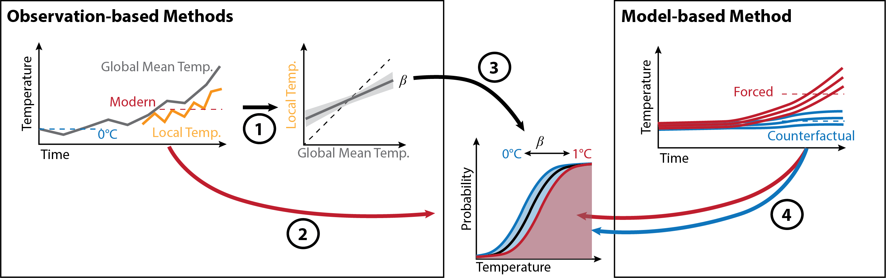

# Code supporting "A multi-method framework for global real-time climate attribution" by Gilford et al. (2022, ASCMO)

This repository is the Python code base for "A multi-method framework for global real-time climate attribution" by Gilford et al. (2022), current in press at *[Advances in Statistical Climatology, Meteorology and Oceanography](https://advances-statistical-climatology-meteorology-oceanography.net/)*.

Project abstract:

> Human-driven climate change has caused a wide range of extreme weather events to become more frequent in recent decades. Although increased and intense periods of extreme weather are expected consequences of anthropogenic climate warming, it remains challenging to rapidly and continuously assess the degree to which human activity alters the probability of specific events. This study introduces a new framework to enable the production and communication of global real-time estimates of how human-driven climate change has changed the likelihood of daily weather events. The framework's multi-method approach implements one model-based and two observation-based methods to provide ensemble attribution estimates with accompanying confidence levels. The framework is designed to be computationally lightweight to allow attributable probability changes to be rapidly calculated using forecasts or the latest observations. The framework is particularly suited for highlighting ordinary weather events that have been altered by human-caused climate change. An example application using daily maximum temperature in Phoenix, AZ, USA highlights the framework's effectiveness in estimating the attributable human influence on observed daily temperatures (and deriving associated confidence levels). Global analyses show that the framework is capable of producing worldwide complementary observational- and model-based assessments of how human-caused climate change changes the likelihoods of daily maximum temperatures. For instance, over 56\% of the Earth's total land area all three framework methods agree that maximum temperatures greater than the pre-industrial 99th percentile have become at least twice as likely in today's human-influenced climate. Additionally over 52\% of land in the tropics, human-caused climate change is responsible for at least five-fold increases in the likelihood of pre-industrial 99th percentile maximum temperatures. By systematically applying this framework to near-term forecasts or daily observations, local attribution analyses can be provided in real time, worldwide. These new analyses create opportunities to enhance communication and provide input and/or context for policy, adaptation, human health and other ecosystem/human-system impact studies.

If you have any questions, comments, or feedback on this work or code, please [contact Daniel](mailto:dgilford@climatecentral.org) or open an [Issue](https://github.com/climatecentral/gilford22_attframework/issues) in the repository.

## Citation

If you use any part of this work, please cite this repository, Gilford et al. (2022), and include a link. The citation for Gilford et al. (2022) will be supplied upon full public release.

## Data

The observational and modeling data used in this work are not currently archived. In the future, we intend to provide them on Zenodo with a doi.

## Getting Started

### Dependencies

*Dependencies and code details are forthcoming*

## File Descriptions

### Figures:

#### Main Text Figures:

* **[Figure 1](./paper_figures/main/fig1.png)** - 
* **[Figure 2](./paper_figures/main/fig2.pdf)** - _forthcoming_
* **[Figure 3](./paper_figures/main/fig3.pdf)** - _forthcoming_
* **[Figure 4](./paper_figures/main/fig2.pdf)** - _forthcoming_

#### Supporting Figures:

* **[Figure S1](./paper_figures/si/figS1.pdf)** -
* **[Figure S2](./paper_figures/si/figS2.pdf)** -
* **[Figure S3](./paper_figures/si/figS3.pdf)** - _forthcoming_
* **[Figure S4](./paper_figures/si/figS4.pdf)** - _forthcoming_
* **[Figure S5](./paper_figures/si/figS5.pdf)** - _forthcoming_
* **[Figure S6](./paper_figures/si/figS6.pdf)** - _forthcoming_
* **[Figure S7](./paper_figures/si/figS7.pdf)** - _forthcoming_
* **[Figure S8](./paper_figures/si/figS8.pdf)** - _forthcoming_
* **[Figure S9](./paper_figures/si/figS9.pdf)** - _forthcoming_
* **[Figure S10a](./paper_figures/si/figS10a.pdf)** - 
* **[Figure S10b](./paper_figures/si/figS10b.pdf)** -
* **[Figure S10c](./paper_figures/si/figS10c.pdf)** -

_Supporting Figures S10d-S12 can be constructed through modification of [BiasAdjust_comparison.ipynb](./BiasAdjust_comparison.ipynb)_.

## Authors

### Code Development and Lead Author
* **Daniel M. Gilford, PhD** - [GitHub](https://github.com/dgilford)

### Code Contributors

* **Andrew Pershing**
* **Kasten Haustein** 

### Study CRediT (Contributor Roles Taxonomy)
**Daniel M. Gilford**: Methodology, Software, Validation, Formal analysis, Investigation, Writing – Original Draft and Review & Editing, and Visualization.
**Andrew Pershing**: Conceptualization, Methodology, Writing – Review & Editing, Visualization, and Supervision.
**Benjamin H. Strauss**: Conceptualization, Methodology, Writing – Review & Editing, and Project administration.
**Karsten Haustein**: Software, Validation, Formal analysis, Investigation, Data Curation, and Writing – Review & Editing.
**Friederike E. L. Otto**: Conceptualization, Methodology, and Writing – Review & Editing.

## License

This project is licensed under the MIT License - see the [LICENSE](LICENSE) file for details.

Portions of this code, specifically the [cmip5_bias_adjustment.py](./cmip5_bias_adjustment.py) module and the [BiasAdjust_model_run.ipynb](./BiasAdjust_model_run.ipynb) notebook are licensed directly under the [GNU Affero General Public License v3.0](https://www.gnu.org/licenses/agpl-3.0.en.html), which is compatible with the MIT License. Source code on which these software products are based is provided in  [/isimip3-source/](./isimip3-source/), and is forked from the [isimip3 repository](https://github.com/ssobie/isimip3) as published on 7 March 2019.

## Acknowledgments

The authors thank [Claudia Tebaldi](https://www.climatecentral.org/what-we-do/people/claudia_tebaldi) for helpful comments which improved this work. We also thank [Lukasz Tracewski](https://www.linkedin.com/in/lukasztracewski/) and [Dan Dodson](https://www.climatecentral.org/what-we-do/people/dan-dodson) for maintaining the computing resources on which the climate attribution framework was developed and tested. For the research conducted in this study, Climate Central received funding, in part, from [The Schmidt Family Foundation](https://tsffoundation.org/)/The Eric and Wendy Schmidt Fund for Strategic Innovation.
